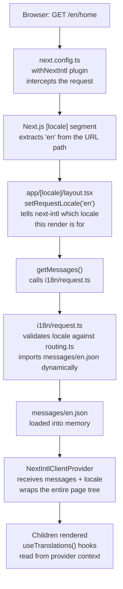
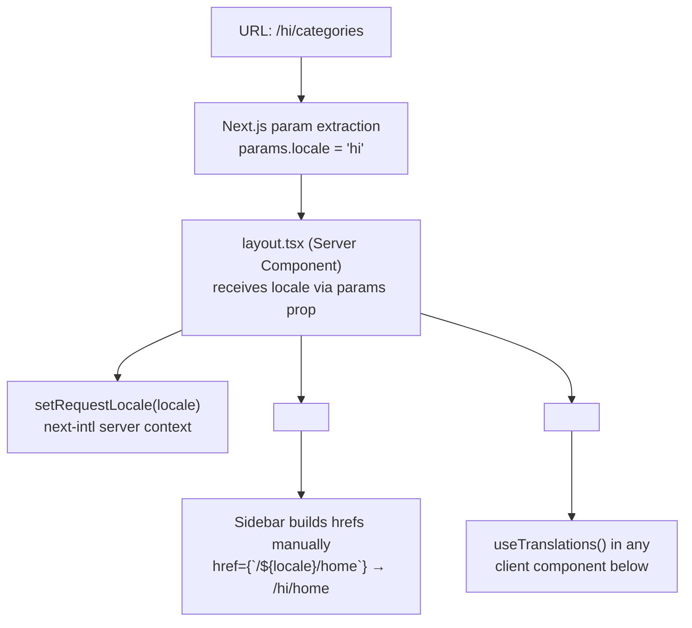
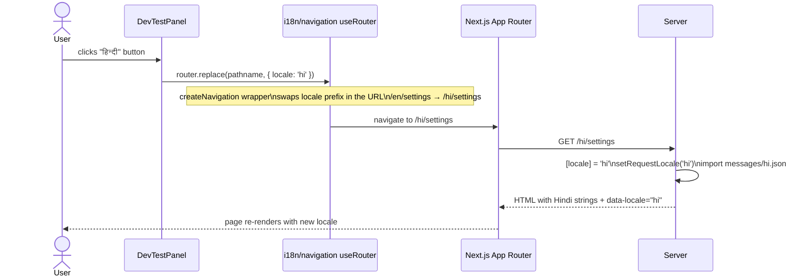
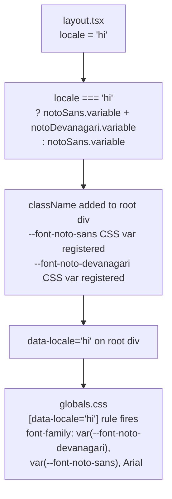
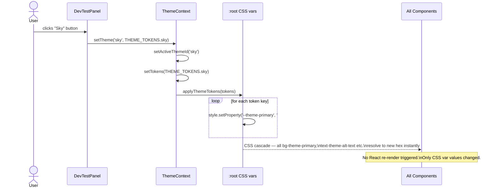
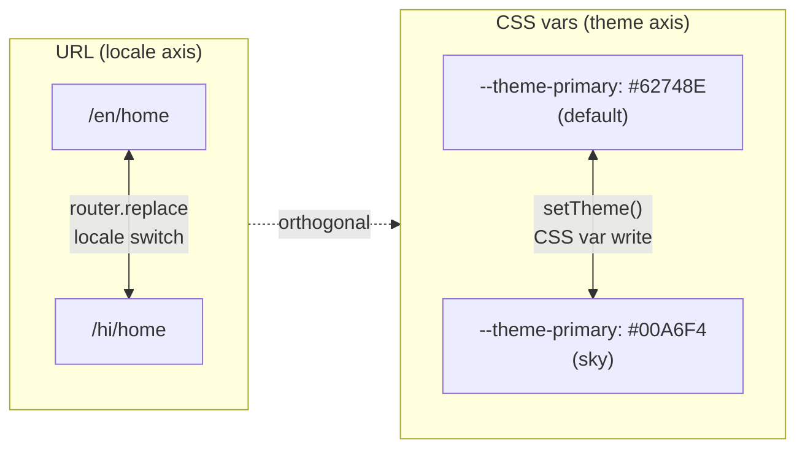

# Mo Speech — i18n and Theme Switching

How locale and theme data flows through the app from a URL request to a rendered component.

---

## The two kinds of switch

| Switch | Mechanism | Page reload? | What changes |
|---|---|---|---|
| **Locale** (`en` ↔ `hi`) | Next.js navigation to a new URL | Yes — full server render | URL prefix, messages, font, `data-locale` attribute |
| **Theme** (`default` ↔ `sky` etc.) | CSS var overwrite in-memory | No — CSS cascade only | CSS custom properties on `:root` |

They are deliberately independent. You can change theme without reloading the page. You cannot change locale without a page load — that is Next.js App Router working as designed.

---

## Locale — server-side pipeline (on every page load)



Nothing is fetched on the client. Messages are bundled into the page during the server render and passed down through `NextIntlClientProvider`. The client receives them as part of the HTML payload — no extra network request.

---

## The key files and what each one does

```
next.config.ts          ← withNextIntl(nextConfig) — registers next-intl with Next.js,
                           activates locale detection, no middleware.ts needed
i18n/
  routing.ts            ← defines valid locales ['en','hi'], defaultLocale 'en',
                           localePrefix: 'always' (locale always in URL)
  request.ts            ← server function: validates locale, imports the right .json
  navigation.ts         ← locale-aware Link, useRouter, usePathname for client components
                           (wraps next-intl createNavigation — used by DevTestPanel)
messages/
  en.json               ← all English strings, keyed by namespace.key
  hi.json               ← all Hindi strings, same key structure
app/
  [locale]/
    layout.tsx          ← setRequestLocale, getMessages, NextIntlClientProvider,
                           font loading, data-locale attribute
    components/
      Sidebar.tsx       ← useTranslations('nav') → t('home') → "Home" / "होम"
      TopBar.tsx        ← useTranslations('nav') + useTranslations('common')
    settings/
      DevTestPanel.tsx  ← locale switcher using i18n/navigation useRouter
```

---

## routing.ts — the locale contract

```ts
// i18n/routing.ts
export const routing = defineRouting({
  locales: ['en', 'hi'],      // all valid locales
  defaultLocale: 'en',        // fallback if URL has no locale prefix
  localePrefix: 'always',     // /en/home and /hi/home — never /home
});
```

This is the single source of truth. `request.ts`, `layout.tsx` (via `generateStaticParams`), and `navigation.ts` all import from here so there is no duplication.

---

## request.ts — server-side message loader

```ts
// i18n/request.ts
export default getRequestConfig(async ({ requestLocale }) => {
  let locale = await requestLocale;

  // Guard: if locale is missing or invalid, fall back to 'en'
  if (!locale || !routing.locales.includes(locale)) {
    locale = routing.defaultLocale;
  }

  return {
    locale,
    messages: (await import(`../messages/${locale}.json`)).default,
  };
});
```

`requestLocale` comes from the URL segment — Next.js resolves `[locale]` and passes it here. The dynamic `import()` means only the needed language file is loaded per request; `hi.json` is never sent to English users.

---

## [locale] — how the URL segment reaches components



`layout.tsx` is a Server Component so it can read `params` directly. It passes `locale` as a prop to `Sidebar` (which builds its own hrefs) and puts it into `NextIntlClientProvider` so client components can call `useTranslations()` without needing to read the URL themselves.

---

## useTranslations — consuming messages in a component

```ts
// Sidebar.tsx (client component)
const t = useTranslations('nav');   // namespace = top-level key in the JSON

t('home')       // → "Home"      (en) or "होम"      (hi)
t('categories') // → "Categories" (en) or "श्रेणियाँ" (hi)
```

The JSON structure maps directly:

```json
{
  "nav": {
    "home": "Home",
    "categories": "Categories"
  }
}
```

`useTranslations('nav')` locks the lookup to the `nav` namespace. `t('home')` resolves the key within that namespace. Missing keys throw at runtime in development — intentional, so broken translations are caught early.

---

## Locale switch — what actually happens



The `useRouter` in `DevTestPanel` comes from `@/i18n/navigation`, not `next/navigation`. This matters: the next-intl router understands the `{ locale }` option and rewrites the URL prefix. The plain Next.js router does not.

---

## Two routers — which to use where

| Import | Knows about locales | Use when |
|---|---|---|
| `import { useRouter } from 'next/navigation'` | No | Navigating within the same locale (most navigation) |
| `import { useRouter } from '@/i18n/navigation'` | Yes | Switching locale (`router.replace(path, { locale: 'hi' })`) |
| `import { usePathname } from 'next/navigation'` | No — returns full path including `/en/` | Reading current URL in Sidebar/TopBar |
| `import { usePathname } from '@/i18n/navigation'` | Yes — strips locale prefix | When you want `/home` not `/en/home` |

**Current usage in this project:**
- `Sidebar.tsx` — `next/navigation` usePathname + manual `/${locale}/segment` hrefs
- `TopBar.tsx` — `next/navigation` usePathname + useParams
- `DevTestPanel.tsx` — `@/i18n/navigation` useRouter + usePathname (needs locale switching)

---

## Font switching — driven by locale, not theme



Two things happen simultaneously:
1. Next.js `next/font/google` registers the CSS variable for the font (only if the `variable` class is present on a DOM node in the tree)
2. `data-locale` tells the CSS which font-family rule to apply

Noto Devanagari is never loaded for English users — `next/font` only includes the font in the page if the variable class is actually rendered.

---

## Theme switch — driven by ThemeContext, not the URL



Theme lives entirely in CSS custom properties on `:root`. Components never read theme values directly — they just use Tailwind utilities (`bg-theme-primary`) which resolve via the CSS vars at paint time. When the vars change, the browser repaints without React needing to know.

---

## How the two switches interact

Locale and theme are independent axes. Switching locale does **not** reset the theme (theme lives in CSS vars, not in the URL). Switching theme does **not** change the locale.



The only coupling point is the font: locale controls which font CSS variable is registered, which then feeds into `globals.css [data-locale]`. Theme has no influence on fonts.

---

## generateStaticParams — build-time pre-rendering

```ts
// app/[locale]/layout.tsx
export function generateStaticParams() {
  return routing.locales.map((locale) => ({ locale }));
  // → [{ locale: 'en' }, { locale: 'hi' }]
}
```

At build time Next.js calls this and pre-renders the layout for every locale. This means `/en/*` and `/hi/*` routes are statically generated shells — no locale detection needed at runtime. The `withNextIntl` plugin compiles this automatically.

---

## Adding a new language

1. Add the locale code to `routing.ts` locales array: `['en', 'hi', 'fr']`
2. Create `messages/fr.json` with the same key structure as `en.json`
3. In `layout.tsx`, add a font load if the language needs a non-Latin script and add it to the `fontClasses` conditional
4. In `DevTestPanel.tsx`, add a button to the `LOCALES` array
5. `generateStaticParams` picks up the new locale automatically — no other changes

---

## File map

```
next.config.ts                    ← withNextIntl plugin — activates i18n in Next.js
i18n/
  routing.ts                      ← locale list + prefix strategy (single source of truth)
  request.ts                      ← server: validates locale, loads messages/*.json
  navigation.ts                   ← client: locale-aware Link, useRouter, usePathname
messages/
  en.json                         ← English strings
  hi.json                         ← Hindi strings
app/
  [locale]/
    layout.tsx                    ← setRequestLocale, getMessages, font vars, data-locale,
                                     NextIntlClientProvider, generateStaticParams
    components/
      Sidebar.tsx                 ← useTranslations('nav'), plain next/navigation
      TopBar.tsx                  ← useTranslations('nav' + 'common'), plain next/navigation
    settings/
      DevTestPanel.tsx            ← locale switch via @/i18n/navigation useRouter
                                     theme switch via useTheme().setTheme()
  contexts/
    ThemeContext.tsx               ← THEME_TOKENS, applyThemeTokens, ThemeProvider
  globals.css                     ← [data-locale="hi"] font rule, --theme-* defaults
```
