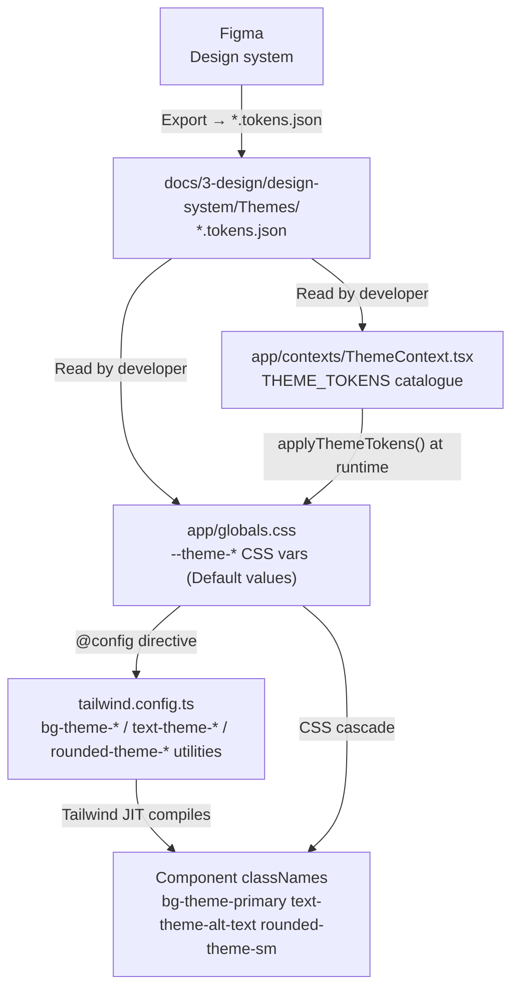
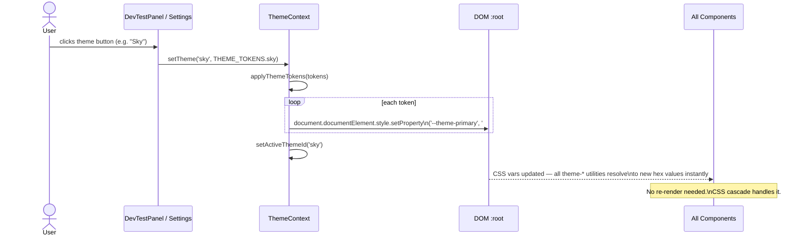
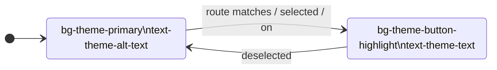
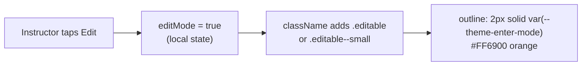

# Mo Speech Design Token System

How themes work end-to-end — from Figma export to a rendered component.

---

## Architecture overview



Three layers:

| Layer | File | Role |
|---|---|---|
| **Source of truth** | `Themes/*.tokens.json` | Figma exports — hex values |
| **Static defaults** | `app/globals.css` `:root` | Default (Slate) theme on first load |
| **Runtime overrides** | `ThemeContext.tsx` | Overwrites CSS vars when theme changes |
| **Named utilities** | `tailwind.config.ts` | Maps Tailwind class → CSS var |
| **Components** | `*.tsx` | Only ever reference token classes |

---

## Runtime theme switching



`applyThemeTokens` converts the `ThemeTokens` object to CSS var writes:

```
{ primary: '#00A6F4' }  →  --theme-primary: #00A6F4
{ roundness: 16 }       →  --theme-roundness: 16px   (numbers get 'px' appended)
```

---

## Token catalogue — what lives where

### Colour tokens (vary per theme)

| Token class | CSS var | Default |
|---|---|---|
| `bg-theme-background` | `--theme-background` | #18181B (zinc/900) |
| `bg-theme-primary` | `--theme-primary` | #62748E (slate/500) |
| `bg-theme-banner` | `--theme-banner` | #45556C (slate/600) |
| `bg-theme-card` | `--theme-card` | #314158 (slate/700) |
| `bg-theme-alt-card` | `--theme-alt-card` | #E4E4E7 (zinc/200) |
| `bg-theme-symbol-bg` | `--theme-symbol-bg` | #FAFAFA (zinc/50) |
| `bg-theme-button-highlight` | `--theme-button-highlight` | #E2E8F0 (slate/200) |
| `text-theme-text` | `--theme-text` | #3F3F46 (zinc/700) |
| `text-theme-secondary-text` | `--theme-secondary-text` | #71717B (zinc/500) |
| `text-theme-alt-text` | `--theme-alt-text` | #FAFAFA (zinc/50) |
| `text-theme-secondary-alt-text` | `--theme-secondary-alt-text` | #D4D4D8 (zinc/300) |
| `border-theme-line` | `--theme-line` | #0F172B (slate/900) |
| `text-theme-enter-mode` | `--theme-enter-mode` | #FF6900 (orange) |
| `text-theme-success` | `--theme-success` | #00C951 (green) |
| `text-theme-warning` | `--theme-warning` | #FB2C36 (red) |

### Spacing tokens (shared, all themes)

| Token class | CSS var | Value |
|---|---|---|
| `p-theme-general` | `--theme-general-padding` | 32px |
| `gap-theme-gap` | `--theme-general-space-between` | 32px |
| `p-theme-modal` | `--theme-modal-padding` | 24px |
| `gap-theme-modal-gap` | `--theme-modal-space-between` | 16px |
| `p-theme-folder` | `--theme-categories-folder-padding` | 20px |
| `px-theme-btn-x` | `--theme-large-buttons-padding` | 16px |
| `py-theme-btn-y` | `--theme-buttons-y-padding` | 8px |
| `p-theme-item` | `--theme-item-padding` | 16px |
| `gap-theme-elements` | `--theme-elements-space-between` | 8px |
| `p-theme-symbol` | `--theme-symbol-card-padding` | 8px |

### Roundness tokens (shared, all themes)

| Token class | CSS var | Value | Used for |
|---|---|---|---|
| `rounded-theme` | `--theme-roundness` | 16px | Cards, symbol tiles, large buttons |
| `rounded-theme-sm` | `--theme-small-roundness` | 8px | Nav buttons, badges, inputs, small controls |

### Typography tokens (shared, all themes)

Font: **Noto Sans** (set in `[data-locale]` in globals.css). Fixed px — not responsive — intentional for multi-language layout stability.

| Token class | CSS var | Size | Weight |
|---|---|---|---|
| `text-theme-h1` | `--theme-text-h1` | 64px | `font-semibold` |
| `text-theme-h2` | `--theme-text-h2` | 48px | `font-semibold` |
| `text-theme-h3` | `--theme-text-h3` | 36px | `font-semibold` |
| `text-theme-h4` | `--theme-text-h4` | 24px | `font-semibold` |
| `text-theme-large` | `--theme-text-large` | 20px | `font-normal` |
| `text-theme-p` | `--theme-text-p` | 16px | `font-normal` or `font-semibold` (p-bold) |
| `text-theme-s` | `--theme-text-s` | 14px | `font-normal` |

Weights are NOT baked into the token — apply `font-semibold` or `font-normal` alongside the size class.

---

## Button state model

All interactive buttons follow a two-state colour contract:



```tsx
// Implementation pattern
const btnActive   = 'bg-theme-button-highlight text-theme-text'
const btnInactive = 'bg-theme-primary text-theme-alt-text hover:opacity-90'

<Link className={cn(btnBase, isActive(segment) ? btnActive : btnInactive)}>
```

This means: the *primary* colour is the **resting** state. It only appears on unselected buttons. The highlight is the **active** state. Inverting this from most UI conventions is intentional — the primary colour is always visible as a navigation affordance.

---

## Edit mode

When an instructor enters edit mode, editable elements receive an orange outline using `--theme-enter-mode`. Orange was chosen because it is distinct from every theme's colour family.



CSS classes (in globals.css):

```css
.editable       { outline: 2px solid var(--theme-enter-mode); border-radius: var(--theme-roundness); }
.editable--small { outline: 2px solid var(--theme-enter-mode); border-radius: var(--theme-small-roundness); }
```

---

## Component semantic classes

Some multi-property patterns are composed as CSS classes (globals.css) rather than repeating Tailwind utility strings:

| Class | Applies |
|---|---|
| `.symbol-card` | Card bg, alt-text colour, theme roundness, symbol padding |
| `.symbol-card__image` | Symbol-bg colour, inner radius (roundness minus padding) |
| `.symbol-card--modelling-target` | Primary-colour outline for modelling highlight |
| `.talker-bar` | Card bg, alt-text, top border in line colour |
| `.app-banner` | Banner bg, alt-text, banner padding |
| `.btn-large` | Primary bg, alt-text, theme roundness, large button padding |
| `.btn-large--active` | Button-highlight bg, text colour (active state) |
| `.btn-small` | Small roundness, button padding |

Use Tailwind token utilities (`bg-theme-*`, `text-theme-*`) for new components. Reserve these classes for the specific structural patterns they cover.

---

## Dev test panel flow

```mermaid
flowchart TD
    A["Settings → DevTestPanel"] --> B{action}
    B -->|"Theme button"| C["setTheme(slug, THEME_TOKENS[slug])"]
    C --> D["applyThemeTokens → CSS vars update\n→ instant visual change"]
    B -->|"Language button"| E["router.replace(pathname, &#123; locale: code &#125;)"]
    E --> F["next-intl navigates to same route\nin target locale"]
```



The panel is a dev-only fixture. Remove before production (it is already marked as such in the component file).

---

## File map

```
app/
  globals.css               ← :root CSS vars (Default values) + component classes
  contexts/
    ThemeContext.tsx         ← THEME_TOKENS catalogue, applyThemeTokens(), ThemeProvider
  [locale]/
    components/
      Sidebar.tsx            ← nav using token classes
      TopBar.tsx             ← header using token classes
      LogoSvg.tsx            ← inline SVG, fill="currentColor" for theme inheritance
    settings/
      DevTestPanel.tsx       ← theme + locale switcher (dev only)

tailwind.config.ts           ← named utility → CSS var mapping

docs/3-design/design-system/
  Themes/
    Default.tokens.json      ← Figma export — source of truth
    Sky.tokens.json
    Amber.tokens.json
    Fuchsia.tokens.json
    Lime.tokens.json
    Rose.tokens.json
```

---

## Adding a new theme

1. Export tokens from Figma → save as `Themes/NewTheme.tokens.json`
2. Add a new entry to `THEME_TOKENS` in `ThemeContext.tsx` — only the 7 per-theme colour values need changing
3. Add a swatch entry to `DevTestPanel.tsx` for testing
4. No changes needed to CSS, Tailwind config, or any component

## Adding a new token

1. Add the CSS var to `:root` in `globals.css` with a default value
2. Add a Tailwind utility mapping to `tailwind.config.ts`
3. Add the key to `ThemeTokens` type and `applyThemeTokens` in `ThemeContext.tsx`
4. Add per-theme values to each entry in `THEME_TOKENS`
