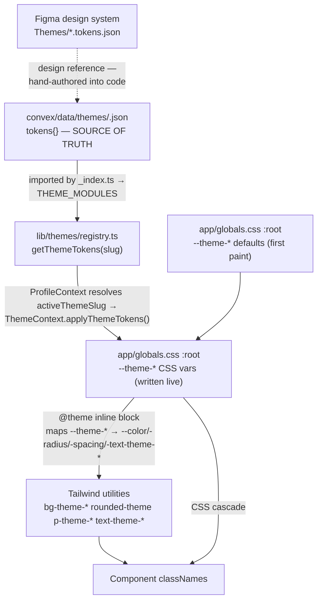
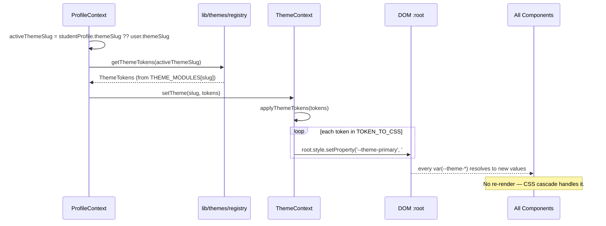
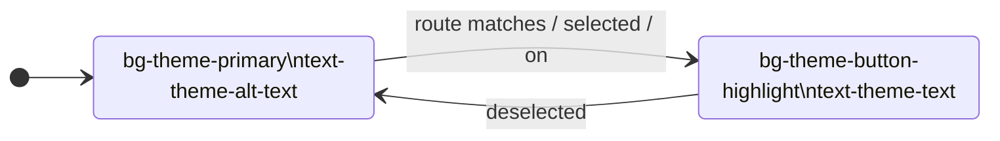

# Mo Speech Design Token System

The token **catalogue** and usage reference: what tokens exist, what they control,
and how components consume them. For the end-to-end *flow* (how a JSON edit reaches
the screen) see the companion [`THEME-JSON-FLOW.md`](./THEME-JSON-FLOW.md) and the
plain-English [`theme-system-explained.md`](./theme-system-explained.md); the
architecture record is [ADR-011 §2](../decisions/ADR-011-plugin-architecture-for-content-modules.md).

> **This project is Tailwind CSS 4 — there is no `tailwind.config.ts`.** Tokens are
> declared as CSS variables in `:root` in `app/globals.css` and mapped to Tailwind
> utilities via the `@theme inline` block in that same file. Any hard-coded colour,
> radius, spacing, or font size breaks runtime theme switching — always use the
> `*-theme-*` utilities.

---

## Where tokens live



| Layer | File | Role |
|---|---|---|
| **Design reference** | `docs/3-design/design-system/Themes/*.tokens.json` | Figma exports. A *design* artefact — hand-authored into the code source below, **not** read by code. |
| **Source of truth** | `convex/data/themes/<slug>.json` → `tokens{}` | The canonical per-theme token values, bundled at build via `_index.ts` → `THEME_MODULES`. |
| **First-paint defaults** | `app/globals.css` `:root` | Default `--theme-*` values used before/without a resolved theme. Also the fallback for every *optional* token a theme omits. |
| **Var → utility mapping** | `app/globals.css` `@theme inline` | Maps each `--theme-*` variable to a Tailwind utility. Keeping `var()` live (via `inline`) is what makes runtime switching work. |
| **Runtime override** | `app/contexts/ThemeContext.tsx` | `applyThemeTokens()` writes the resolved theme's values onto `:root` at render. |
| **Components** | `*.tsx` | Only ever reference `*-theme-*` utilities — never raw values. |

---

## Runtime theme switching

A profile stores only a `themeSlug`; token values are resolved live from the bundled
JSON on every render — never photocopied per account. (Full trace in
[`THEME-JSON-FLOW.md`](./THEME-JSON-FLOW.md).)



`applyThemeTokens` (in `ThemeContext.tsx`) walks the `TOKEN_TO_CSS` map, converting
each `ThemeTokens` property to a CSS-var write. Numbers get `px` appended unless the
key is in `UNITLESS_TOKENS`; tokens a theme omits are `removeProperty`'d so the
`:root` default shows through:

```
{ primary: '#2B7FFF' }  →  --theme-primary: #2B7FFF
{ roundness: 16 }       →  --theme-roundness: 16px   (numeric → px)
{ surfaceBlur: 14 }     →  --theme-surface-blur: 14px
(token absent)          →  removeProperty → falls back to globals.css :root
```

---

## Token catalogue

### Colours — per-theme, required

Every theme JSON supplies all of these. Live values are canonical in
`convex/data/themes/<slug>.json` (e.g. the `default`/"Classic" theme); they are
**not** duplicated here to avoid drift.

| Token utility | CSS var | Role |
|---|---|---|
| `bg-theme-background` | `--theme-background` | App backdrop |
| `bg-theme-primary` | `--theme-primary` | Resting/primary surface (buttons at rest) |
| `bg-theme-banner` | `--theme-banner` | Page banner |
| `bg-theme-card` | `--theme-card` | Card surface |
| `bg-theme-alt-card` | `--theme-alt-card` | Inverted/secondary card |
| `bg-theme-symbol-bg` | `--theme-symbol-bg` | Symbol image plate |
| `bg-theme-button-highlight` | `--theme-button-highlight` | Active/selected button |
| `text-theme-text` | `--theme-text` | Primary ink (on light surfaces) |
| `text-theme-secondary-text` | `--theme-secondary-text` | Secondary ink |
| `text-theme-alt-text` | `--theme-alt-text` | Ink on primary/dark surfaces |
| `text-theme-secondary-alt-text` | `--theme-secondary-alt-text` | Secondary alt ink |
| `border-theme-line` | `--theme-line` | Dividers, hairlines |
| `text-theme-enter-mode` | `--theme-enter-mode` | Edit-mode outline (orange) |
| `text-theme-success` | `--theme-success` | Success status |
| `text-theme-warning` | `--theme-warning` | Warning/error status |
| `bg-theme-pill-bg` | `--theme-pill-bg` | Pill/chip surface |

> **Ink semantics (see [theme token memory / ADR-011 §2]).** `altText` /
> `secondaryAltText` are the *main* text colours (ink on the primary-coloured
> surfaces that dominate the UI); `text` / `secondaryText` are the rarer inverted
> inks kept dark for light cards. Don't assume `text` is the default body colour.

**Optional colour add-ons** (a flat theme may omit; falls back to `:root`):
`--theme-pack-bg` (`bg-theme-pack-bg`).

**Derived (computed live, no JSON field):** `--theme-primary-50`, `--theme-primary-25`
are `color-mix()` tints of `--theme-primary` in `globals.css` — they auto-track the
active theme.

### Four-layer model — per-theme, optional (animated / glass themes)

Introduced in ADR-011 §2.1. Flat themes omit these entirely (solid `--theme-background`
shows through); animated themes like `midnight_glass` supply them to build a layered,
glassmorphic surface.

| CSS var | Role |
|---|---|
| `--theme-bg-layer` | Gradient/animated backdrop replacing the solid background |
| `--theme-texture-image` / `--theme-texture-blend` / `--theme-texture-opacity` | Procedural grain overlay |
| `--theme-surface` / `--theme-surface-bar` | Translucent card / bar fills |
| `--theme-surface-blur` / `--theme-surface-saturate` / `--theme-surface-border` | Backdrop-filter blur, saturation, hairline for the glass chrome |

Animation tokens (animated themes only): `--theme-bg-animation`,
`--theme-bg-animation-duration`, `--theme-card-animation`.

### Roundness

Core two are always present (default in `globals.css`, per-theme override optional):

| Token utility | CSS var | Default | Used for |
|---|---|---|---|
| `rounded-theme` | `--theme-roundness` | 16px | Cards, symbol tiles, large buttons |
| `rounded-theme-sm` | `--theme-small-roundness` | 8px | Nav buttons, badges, inputs, small controls |

Per-component roundness (the Figma "Finals" set — optional per-theme overrides):
`--theme-button-roundness` (`rounded-theme-button`), `--theme-card-roundness`,
`--theme-pack-card-roundness`, `--theme-modal-roundness`, `--theme-chip-roundness`.

### Elevation — per-theme, optional

`--theme-elevation-subtle`, `--theme-elevation-surface`, `--theme-elevation-modal`
(box-shadow strings). Fall back to `globals.css` defaults when a theme omits them.

### Spacing — default in globals.css, per-theme override optional

| Token utility | CSS var | Default |
|---|---|---|
| `p-theme-general` | `--theme-general-padding` | 32px |
| `gap-theme-gap` | `--theme-general-space-between` | 32px |
| `p-theme-modal` | `--theme-modal-padding` | 24px |
| `gap-theme-modal-gap` | `--theme-modal-space-between` | 16px |
| `p-theme-folder` | `--theme-categories-folder-padding` | 20px |
| `px-theme-btn-x` | `--theme-large-buttons-padding` | 16px |
| `py-theme-btn-y` | `--theme-buttons-y-padding` | 8px |
| `p-theme-item` | `--theme-item-padding` | 16px |
| `gap-theme-elements` | `--theme-elements-space-between` | 8px |
| `p-theme-symbol` | `--theme-symbol-card-padding` | 8px |
| — | `--theme-header-talker-padding` | header/talker inset |

### Typography — global, fixed px (never per-theme)

Font: **Noto Sans** (Devanagari and other script fonts activated per language).
Sizes are fixed px, not responsive — intentional for multi-language layout stability.
Line-heights are set alongside each size in the `@theme inline` block.

| Token utility | CSS var | Size |
|---|---|---|
| `text-theme-h1` | `--theme-text-h1` | 64px |
| `text-theme-h2` | `--theme-text-h2` | 48px |
| `text-theme-h3` | `--theme-text-h3` | 36px |
| `text-theme-h4` | `--theme-text-h4` | 24px |
| `text-theme-large` | `--theme-text-large` | 20px |
| `text-theme-p` | `--theme-text-p` | 16px |
| `text-theme-s` | `--theme-text-s` | 14px |
| `text-theme-xs` | `--theme-text-xs` | 11px |

Weight is **not** baked into the size token — apply `font-semibold` / `font-normal`
alongside the size class.

---

## Button state model

All interactive buttons follow a two-state colour contract:



```tsx
const btnActive   = 'bg-theme-button-highlight text-theme-text'
const btnInactive = 'bg-theme-primary text-theme-alt-text hover:opacity-90'

<Link className={cn(btnBase, isActive(segment) ? btnActive : btnInactive)}>
```

The *primary* colour is the **resting** state (unselected buttons); the highlight is
the **active** state. Inverting this from most UI conventions is intentional — the
primary colour stays visible as a navigation affordance.

---

## Edit mode

When an instructor enters edit mode, editable elements receive an orange outline via
`--theme-enter-mode`. Orange is distinct from every theme's colour family.

```css
.editable        { outline: 2px solid var(--theme-enter-mode); border-radius: var(--theme-roundness); }
.editable--small { outline: 2px solid var(--theme-enter-mode); border-radius: var(--theme-small-roundness); }
```

---

## Component semantic classes

Some multi-property patterns are composed as CSS classes (in `globals.css`) rather
than repeating Tailwind strings:

| Class | Applies |
|---|---|
| `.symbol-card` | Card bg, alt-text colour, theme roundness, symbol padding |
| `.symbol-card__image` | Symbol-bg colour, inner radius (roundness minus padding) |
| `.talker-bar` | Card bg, alt-text, top border in line colour |
| `.app-banner` | Banner bg, alt-text, banner padding |
| `.btn-large` | Primary bg, alt-text, theme roundness, large button padding |
| `.btn-large--active` | Button-highlight bg, text colour (active state) |
| `.btn-small` | Small roundness, button padding |

Use `bg-theme-*` / `text-theme-*` utilities for new components. Reserve these classes
for the specific structural patterns they cover.

---

## File map

```
convex/data/themes/
  <slug>.json            ← token values — SOURCE OF TRUTH (default, sky, amber,
                            fuchsia, lime, rose, midnight_glass, …)
  _index.ts              ← barrel → THEME_MODULES (compile-time bundle)
  types.ts               ← ThemeTokens / ThemeModule types (the token schema)
convex/lib/themes.ts     ← server-side getThemeBySlug / getAllThemes (reads the bundle)
convex/schema.ts         ← themeLifecycle table (publish/tier/feature overlay)

lib/themes/registry.ts   ← client getThemeTokens(slug) / THEME_SLUGS / DEFAULT_THEME_SLUG
app/contexts/
  ProfileContext.tsx     ← resolves activeThemeSlug → setTheme
  ThemeContext.tsx       ← TOKEN_TO_CSS map, applyThemeTokens(), THEME_TOKENS (derived)
app/globals.css          ← :root --theme-* defaults + @theme inline mapping + semantic classes

docs/3-design/design-system/Themes/*.tokens.json   ← Figma design reference (not read by code)
```

---

## Adding a new theme

1. Create `convex/data/themes/<slug>.json` — `slug`, localised `name`, `previewColour`,
   `type` (`"flat"` or animated), `defaultTier`, `builtin`, and the `tokens{}` object
   (all required colours; optional roundness/spacing/elevation/four-layer overrides).
2. Register it in `convex/data/themes/_index.ts` so it joins `THEME_MODULES`.
3. To make it visible in-app, create a `themeLifecycle` row (publish window / tier /
   featured) via the admin Themes section — the JSON existing is necessary but not
   sufficient; a published lifecycle row is what surfaces it.
4. No CSS, component, or (non-existent) Tailwind-config changes needed.

## Adding a new token

1. Add the field to the `ThemeTokens` type in `convex/data/themes/types.ts`.
2. Add its `property → --theme-var` entry to `TOKEN_TO_CSS` in `ThemeContext.tsx`
   (and to `UNITLESS_TOKENS` if it's a raw number that must not get `px`).
3. Add the `--theme-*` default to `:root` in `globals.css`, and map it in the
   `@theme inline` block (`--color-theme-*` / `--radius-theme-*` / `--spacing-theme-*`
   / `--text-theme-*`) to generate the utility.
4. Set per-theme values in the theme JSONs that need to override the default.

---

## The dead legacy path (do not use)

A vestigial `themes` Convex table and `convex/themes.ts` (`listThemes`,
`getThemeBySlug`, `getThemeById`, `seedStarterThemes`) still exist carrying an **older,
incompatible token shape** (`bgPrimary`, `talkerBg`, … — not the `--theme-*` names).
They are **unreferenced at runtime** and scheduled for deferred cleanup, exactly as
ADR-010 treats `resourcePacks`. See [ADR-011 §2.5](../decisions/ADR-011-plugin-architecture-for-content-modules.md).

Likewise `THEME_TOKENS` in `ThemeContext.tsx` still exists but is now **derived** from
the JSON `THEME_MODULE_MAP` (a back-compat shim), not a hand-maintained catalogue.
New code should call `getThemeTokens(slug)` from `lib/themes/registry.ts`.
