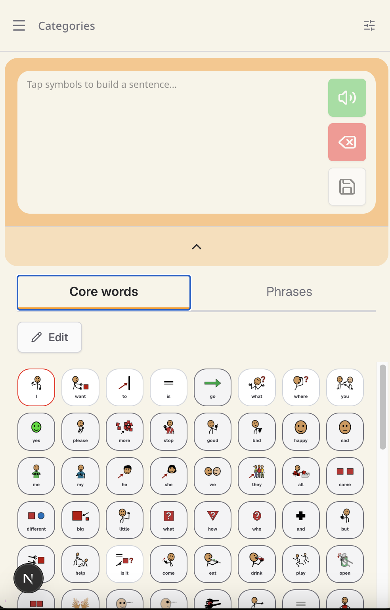
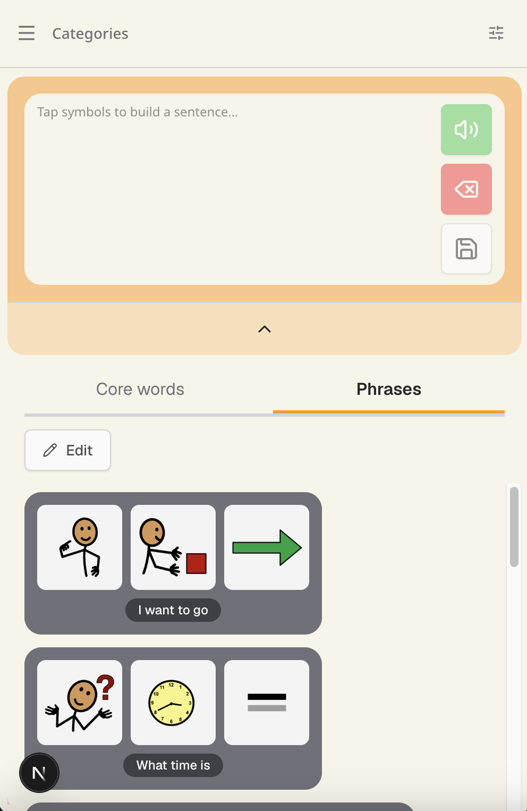
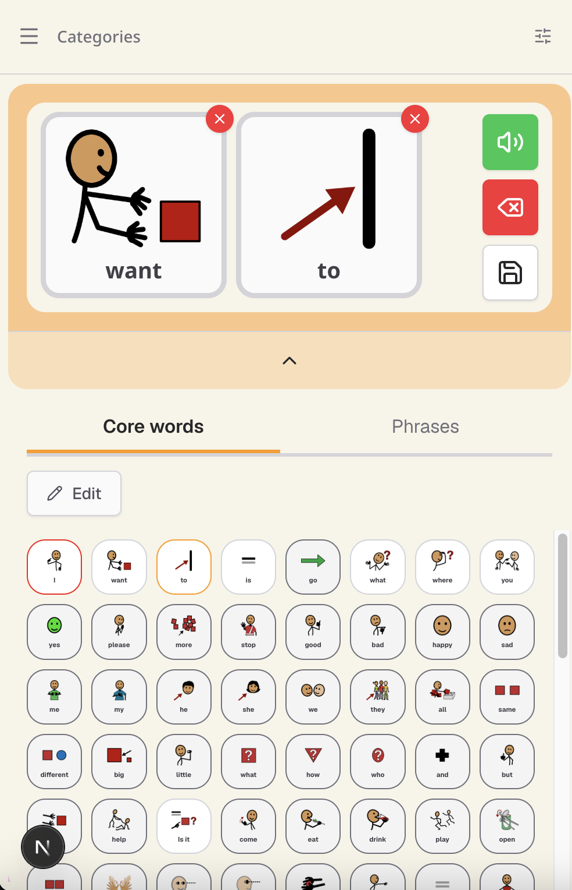

# Talker Dropdown — Responsive Pass

**Status:** Shipped (2026-07-26) · **Date:** 2026-07-25 · **Relates to:** [FEAT-004](./FEAT-004-sentence-builder-talker.md), [ADR-004](../decisions/ADR-004-persistent-global-talker.md) · Make the talker dropdown responsive — core-words grid columns step by viewport × grid-size (see the **Resolved design** section for the authoritative map), phrase tiles shrink below `md`, and the talker tray scrolls horizontally at all widths instead of stacking rows.

The two tabs work well, but the core words resize too small while the phrases stay the same size and look too big. They use different arrangement systems, so each needs its own responsive fit.

---

## The problem

Noticed using the talker dropdown at a small screen size in Chrome. There are no responsive breakpoints on either tab. On small screens the core words look too small and the phrases look too big. The symbols entering the talker area to be played are also too big for small screens — and instead of scrolling, they **stack to the next row**, pushing the rest of the control out of view.

So there are two size problems (core words, phrases) plus a layout problem (the talker tray stacking rather than scrolling).

## Proposed solution

> **Superseded by the *Resolved design* section below.** The original "2 / 4 / 6" sketch below was the vault-triage first pass; it was replaced during the build with the viewport × grid-size map (2/2/4, 3/4/8, 4/8/12) that mirrors `CategoryBoardGrid`. Kept here as origin history — do **not** implement these numbers.

**Core-words grid — responsive column steps (original sketch, superseded):**

| Screen | Columns |
|---|---|
| Large | 2 |
| Medium | 4 |
| Small | 6 |

**Phrases:** currently arranged in rows, appearing sequentially like words in a sentence. At the small breakpoint, start shrinking the phrase tiles down to fit mobile screens better. This will likely need trial and error — a good candidate for front-end-agent suggestions.

**Talker tray:** reduce symbol size on small screens, and implement **horizontal scrolling** for the symbols in the play area so they no longer stack to a second row and obscure the rest of the control.

## Resolved design (build session 2026-07-26)

Breakpoint basis: the app's existing Tailwind tiers — `md` = 768px, `lg` = 1024px — matching `CategoryBoardGrid` and `useIsSmallScreen`. Desktop (`lg`) behaviour is unchanged throughout; these changes only add the missing mobile/`md` tiers.

**MOS-5 — Core-words grid (viewport × grid-size setting).** The talker core grid derives its column count *only* from the profile `grid_size` setting and ignores the viewport, so a narrow panel keeps the desktop column count and cells shrink. Resolution (owner decision): layer viewport breakpoints on top of the grid-size setting, **exactly as `CategoryBoardGrid` does** — same column map:

| grid-size | mobile | md | lg |
|---|---|---|---|
| large | 2 | 2 | 4 |
| medium | 3 | 4 | 8 |
| small | 4 | 8 | 12 |

The talker grid uses the column count as a *number* for slot math (`rows`/`totalCells`), not just a CSS class, so the count must be reactive. A small SSR-safe `useGridColumns(gridSize)` helper (matchMedia, same pattern as `useIsSmallScreen`) returns the active count for the current tier; both the `gridTemplateColumns` and the slot math read it. On a narrow screen a `large` board steps 4 → 2 columns, making symbols bigger (fixes the "too small" complaint).

**MOS-6 — Phrase tiles shrink on small screens (CSS-only).** Normal-mode `PhraseDropdownCard` word tiles (`w-20 h-20`) and the tray `PhraseBox` words (`w-24 h-24`) are fixed. Add a mobile tier that shrinks them (`md:` restores desktop size), tuned visually against the real board.

**MOS-7 — Talker tray: smaller + horizontal scroll (CSS-only).** The tray chip area is `flex-wrap … overflow-y-auto`, so chips stack to new rows and push the rest of the control off-screen. Switch to horizontal scroll at **all** widths (`flex-nowrap overflow-x-auto`), so the chip row never wraps — one horizontally-scrolling row on every screen. Word chip width still shrinks on mobile (`w-28 md:w-40`).

> **Correction (2026-07-26):** the MOS-7 Linear issue said "on small screens" — that was an error. The owner wants the chip area to scroll horizontally at **every** screen size, not only below `md`. The desktop wrap behaviour is intentionally replaced, not preserved.

## Links

- Linear: [Talker dropdown project](https://linear.app/mo-intelligence/project/talker-dropdown-c217e50dc7d5) — *Responsive pass* milestone: MOS-5 (core-words grid), MOS-6 (phrase tiles), MOS-7 (talker tray)
- Source idea: promoted from vault `00_inbox` (2026-07-23), archived at `99_archive/Mo Speech talker-dropdown notes.md`
