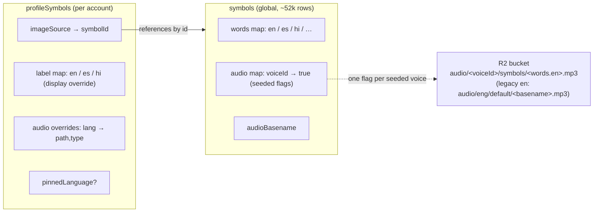
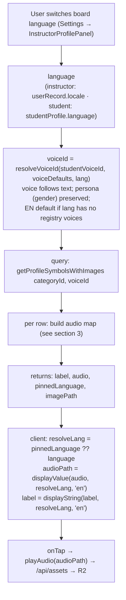
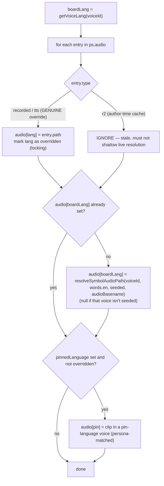

# Audio & Voice-Follows-Text — Language Switching

**Status:** Categories shipped · Lists / Sentences / Phrases not yet audited
**Relates to:** ADR-009 (localisation + audio §4/§9) · ADR-014 §4 + ADR-015 §3 ("structure frozen, text live") · Phase 8.4 (voice seeding) · Phase 15 (voice-follows-text, persona preservation)

> **One-line vision:** when the board language switches, every symbol's **label and audio follow the new language automatically** — resolved live from the global `symbols` table + the board voice — and an instructor can override any one language's audio independently without affecting the others. Adding a new language never requires re-seeding a single `profileSymbol`.

> **Scope note:** this doc is the durable model for how audio resolves + switches. It is written from the **categories** surface (`getProfileSymbolsWithImages`), which is fully audited + fixed. **Lists, Sentences, and Phrases resolve audio through their own paths and are NOT yet audited** — §7 tracks them; append findings there as we author on each.

---

## 1. The three storage layers

Audio is never stored per-language on the profile symbol by default. It is *resolved* from a global source at render time. Three layers:

- **Global `symbols`** — the source of truth. `words` holds every language's text; `audio` is a `{voiceId → true}` map recording **which voices have a seeded R2 clip**; `audioBasename` is the legacy filename key.
- **`profileSymbols`** — the per-account board tile. For a SymbolStix tile it is mostly a **reference** (`imageSource.symbolId`) plus a display `label` override and an optional per-language `audio` override map. **It carries no language-specific audio by default.**
- **R2** — the actual mp3s. Key = `audio/<voiceId>/symbols/<words.en>.mp3` (the English word is the *stable cross-language filename*; the **spoken content is `words[lang]`** for that voice's language — a Hindi voice's `play.mp3` says "खेलना"). Legacy `en-GB-News-M` uses `audio/eng/default/<basename>.mp3`. See `scripts/seed-voice-audio.mjs`.

**Why this shape:** adding a language = add `words[lang]` to the global symbols + seed that voice's R2 clips + flip the `audio[voiceId]` flags. Every existing board picks it up live — **no `profileSymbol` re-seed** (ADR-015 §3).

---

## 2. End-to-end flow — what happens on a language switch

Key point: **`language` and `voiceId` are coupled** — `voiceId = resolveVoiceId({ lang: language })` (see `lib/audio/resolveVoiceId.ts` + `app/contexts/ProfileContext.tsx`). Switching language re-runs the query with a new `voiceId`, which re-resolves every audio path. The **label** updates instantly client-side (it lives in `ps.label`, all languages); the **audio** updates via the query re-run.

---

## 3. Building the audio map (the resolution rules)

`getProfileSymbolsWithImages` builds `audio: { lang → path }` per symbol. Precedence:

Three kinds of `ps.audio` entry — **only two are real overrides**:

| `type` | Meaning | Treated as |
|---|---|---|
| `recorded` | Instructor recording for a language | **Genuine, locking, per-language override** |
| `tts` | "Generate Audio" (instructor TTS) for a language | **Genuine, locking, per-language override** |
| `r2` | SymbolStix default **cached at author time** with the author-time board voice | **Ignored** — the live board-voice resolution supersedes it |

The **board-language default** is `resolveSymbolAudioPath(voiceId, words.en, seeded)` = `audio/<voiceId>/symbols/<words.en>.mp3`, keyed under `boardLang`. Client `displayValue(audio, resolveLang, "en")` then prefers `audio[resolveLang]`, falling back to `audio.en` only when the resolved language has no entry.

---

## 4. The two invariants (each was a real bug — keep them true)

1. **`type:"r2"` never populates the audio map.**
   The editor caches the SymbolStix default into `ps.audio.en = {type:"r2"}` at author time (with the *author-time* board voice — usually EN). If that entry is treated as an override it fills `audio.en` and **blocks the live board-voice re-resolution**, freezing every board to the authoring language. Symptom: labels switched, audio stayed EN. Fix: skip `r2` entries so the default is re-derived per board voice. (`fix(audio): stop frozen r2 default from shadowing board-voice resolution`.)

2. **The default is keyed by the board language, not a hard-coded `"en"`.**
   Seeding the default under `"en"` meant a genuine per-language override (e.g. Generate Audio on the EN tile) sat in `audio.en` and became the **cross-language fallback** via `displayValue(audio, lang, "en")` — so hi/es boards played the EN override. Fix: seed under `boardLang = getVoiceLang(voiceId)` and skip only when *that* language has a real override, so each language starts from its own default and overrides stay independent. (`fix(audio): key the board default by board language so overrides stay per-language`.)

**Together they deliver the spec:** each language starts from its symbols-table-derived default (in that language's voice); Generate Audio / recordings customise **one** language without leaking into the others.

---

## 5. Edge cases & gotchas

- **A language with no registry voices → EN default voice.** `voiceForLanguage` falls through to `DEFAULT_VOICE_ID` when `getLanguage(lang).voices` is empty (e.g. Punjabi today). Result: label switches, audio is EN — *expected* until that language gets seeded voices. Voice counts live in `convex/data/languages/<code>.json`.
- **Unseeded voice for a specific symbol → silence, not EN.** If `symbols.audio[voiceId] !== true`, `resolveSymbolAudioPath` returns `null`, so `audio[boardLang]` is unset and (absent an override) playback is silent rather than falling back to an English clip. Acceptable for seeded languages (hi/es); revisit if a graceful EN fallback is wanted.
- **Filename is `words.en`, content is `words[lang]`.** The R2 key uses the English word even for non-EN voices (stable identifier). Filenames can contain spaces (`stop sign.mp3`) — `/api/assets` must handle encoding.
- **Persona preserved across a switch.** `resolveVoiceId` maps a stated voice preference's gender/age into the target language (`voiceForLanguage`) — a male EN voice becomes a male Hindi voice, not "voices[0]".
- **`r2` caches are harmless but stale.** Existing `ps.audio.en = {type:"r2"}` rows are simply ignored now; no migration was needed. (Optional future cleanup: stop the editor persisting them.)

---

## 6. Where categories resolve audio (reference)

| Concern | Where |
|---|---|
| Board language + voice | `app/contexts/ProfileContext.tsx` (`language`, `voiceId`) · `lib/audio/resolveVoiceId.ts` |
| Server audio-map build | `convex/profileCategories.ts` → `getProfileSymbolsWithImages` |
| R2 path convention | `lib/audio/resolveAudioPath.ts` → `resolveSymbolAudioPath` |
| Voice → language lookup | `lib/languages/registry.ts` → `getVoiceLang` / `getVoiceEntry` / `getLanguage` |
| Client playback selection | `app/components/app/categories/sections/CategoryDetailContent.tsx` (`displayValue(sym.audio, resolveLang, DEFAULT_LOCALE)`) |
| R2 seeding (content per voice) | `scripts/seed-voice-audio.mjs` · check existence: `scripts/checkR2Audio.mjs` |
| Query consumers | `CategoryDetailContent`, `CategoriesContent`, `ModellingPickerModal` |

---

## 7. Per-surface audit status

The rules in §3/§4 are implemented in `getProfileSymbolsWithImages` only. Other surfaces resolve symbol/word audio through their own code and **must be audited against the same two invariants** (skip `r2`; key default by board language). Append findings as each is authored.

| Surface | Resolver | Status | Notes |
|---|---|---|---|
| **Categories board** | `getProfileSymbolsWithImages` | ✅ **Audited + fixed** | Both invariants in place; verified hi/es/en + per-language overrides. |
| Lists | _tbd_ | ⏳ Not audited | Check how list items resolve audio + whether they read `ps.audio.en` directly. |
| Sentences | _tbd_ | ⏳ Not audited | Block/sequence sentences play per-unit clips (ADR-015); verify unit audio follows board voice. |
| Phrases | _tbd_ | ⏳ Not audited | Phrase word clips + `profilePhrases.audioPath`; verify vs board voice. |
| Talker bar | _tbd_ | ⏳ Not audited | Fringe board tiles; likely same symbol-audio path as categories. |

> When you audit a surface: confirm (1) it re-resolves per board voice (no frozen author-time cache), (2) it keys defaults by board language (no cross-language override bleed), (3) it uses the same `resolveSymbolAudioPath` convention. Record the resolver file + any fix commit in the row above.
