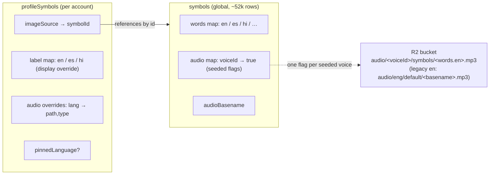
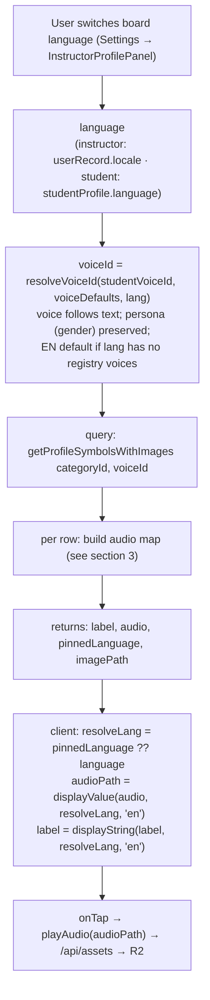
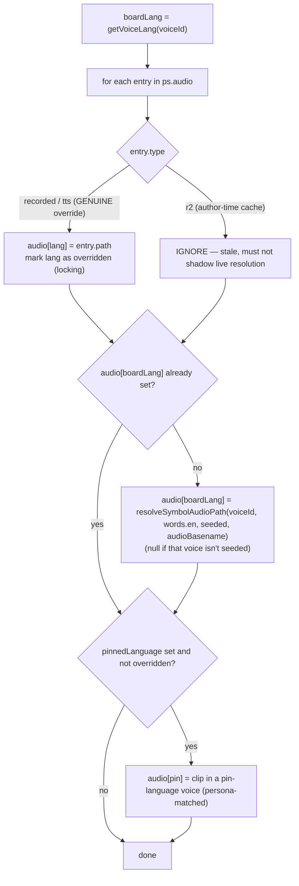

# Audio & Voice-Follows-Text — Language Switching

**Status:** Categories shipped · Lists / Sentences / Phrases not yet audited
**Relates to:** ADR-009 (localisation + audio §4/§9) · ADR-014 §4 + ADR-015 §3 ("structure frozen, text live") · Phase 8.4 (voice seeding) · Phase 15 (voice-follows-text, persona preservation)

> **One-line vision:** when the board language switches, every symbol's **label and audio follow the new language automatically** — resolved live from the global `symbols` table + the board voice — and an instructor can override any one language's audio independently without affecting the others. Adding a new language never requires re-seeding a single `profileSymbol`.

> **Scope note:** this doc is the durable model for how audio resolves + switches. It is written from the **categories** surface (`getProfileSymbolsWithImages`), which is fully audited + fixed. **Lists, Sentences, and Phrases resolve audio through their own paths and are NOT yet audited** — §7 tracks them; append findings there as we author on each.

---

## 1. The three storage layers

Audio is never stored per-language on the profile symbol by default. It is *resolved* from a global source at render time. Three layers:

- **Global `symbols`** — the source of truth. `words` holds every language's text; `audio` is a `{voiceId → true}` map recording **which voices have a seeded R2 clip**; `audioBasename` is the legacy filename key.
- **`profileSymbols`** — the per-account board tile. For a SymbolStix tile it is mostly a **reference** (`imageSource.symbolId`) plus a display `label` override and an optional per-language `audio` override map. **It carries no language-specific audio by default.**
- **R2** — the actual mp3s. Key = `audio/<voiceId>/symbols/<words.en>.mp3` (the English word is the *stable cross-language filename*; the **spoken content is `words[lang]`** for that voice's language — a Hindi voice's `play.mp3` says "खेलना"). Legacy `en-GB-News-M` uses `audio/eng/default/<basename>.mp3`. See `scripts/seed-voice-audio.mjs`.

**Why this shape:** adding a language = add `words[lang]` to the global symbols + seed that voice's R2 clips + flip the `audio[voiceId]` flags. Every existing board picks it up live — **no `profileSymbol` re-seed** (ADR-015 §3).

---

## 2. End-to-end flow — what happens on a language switch

Key point: **`language` and `voiceId` are coupled** — `voiceId = resolveVoiceId({ lang: language })` (see `lib/audio/resolveVoiceId.ts` + `app/contexts/ProfileContext.tsx`). Switching language re-runs the query with a new `voiceId`, which re-resolves every audio path. The **label** updates instantly client-side (it lives in `ps.label`, all languages); the **audio** updates via the query re-run.

---

## 3. Building the audio map (the resolution rules)

`getProfileSymbolsWithImages` builds `audio: { lang → path }` per symbol. Precedence:

Three kinds of `ps.audio` entry — **only two are real overrides**:

| `type` | Meaning | Treated as |
|---|---|---|
| `recorded` | Instructor recording for a language | **Genuine, locking, per-language override** |
| `tts` | "Generate Audio" (instructor TTS) for a language | **Genuine, locking, per-language override** |
| `r2` | SymbolStix default **cached at author time** with the author-time board voice | **Ignored** — the live board-voice resolution supersedes it |

The **board-language default** is `resolveSymbolAudioPath(voiceId, words.en, seeded)` = `audio/<voiceId>/symbols/<words.en>.mp3`, keyed under `boardLang`. Client `displayValue(audio, resolveLang, "en")` then prefers `audio[resolveLang]`, falling back to `audio.en` only when the resolved language has no entry.

---

## 4. The two invariants (each was a real bug — keep them true)

1. **`type:"r2"` never populates the audio map.**
   The editor caches the SymbolStix default into `ps.audio.en = {type:"r2"}` at author time (with the *author-time* board voice — usually EN). If that entry is treated as an override it fills `audio.en` and **blocks the live board-voice re-resolution**, freezing every board to the authoring language. Symptom: labels switched, audio stayed EN. Fix: skip `r2` entries so the default is re-derived per board voice. (`fix(audio): stop frozen r2 default from shadowing board-voice resolution`.)

2. **The default is keyed by the board language, not a hard-coded `"en"`.**
   Seeding the default under `"en"` meant a genuine per-language override (e.g. Generate Audio on the EN tile) sat in `audio.en` and became the **cross-language fallback** via `displayValue(audio, lang, "en")` — so hi/es boards played the EN override. Fix: seed under `boardLang = getVoiceLang(voiceId)` and skip only when *that* language has a real override, so each language starts from its own default and overrides stay independent. (`fix(audio): key the board default by board language so overrides stay per-language`.)

**Together they deliver the spec:** each language starts from its symbols-table-derived default (in that language's voice); Generate Audio / recordings customise **one** language without leaking into the others.

### Authoring side — the symbol editor writes overrides per board language

The read path above only works if overrides are *stored* per language. The symbol editor (`SymbolEditorModal` + `PropertiesPanel`) keys **load / generate / save** by the **effective editing language** (`draft.pinnedLanguage ?? board language`) — not a hard-coded `en` slot (the original Phase 8.0 limitation):

- **Generate** synthesises *that language's* label (`labelLoc[lang]`, else the English label) with a persona-matched voice for it — so generating on a Spanish board produces "escribir" in a Spanish voice, not "write".
- **Save** merges the entry into `ps.audio[lang]`, **preserving other languages' overrides**. Reverting a language to its default **removes only that language's entry** (no `r2` written — the query ignores `r2` anyway).
- **Load** reads `ps.audio[lang]` so re-opening the editor on that board shows that language's own override.

So one symbol can carry independent `en` / `es` / `hi` overrides, each authored on its own board, and the **Save** button always updates the language you're currently on. Backend already accepts arbitrary language keys (`audio: v.record(...)`), so this was a client-only fix (`fix(symbol-editor): author audio per board language`).

### Publish → seed round-trip (per-symbol audio in default/tiered modules)

Authored audio must also survive **publish → libraryModules → install** or a seeded account loses it. Symbolstix category-module symbols originally carried only `symbolId` + `labelOverride` (audio was assumed to always be the symbolstix default), so an author's generated audio was dropped on seed — a new signup fell back to the default (the *write/writer* edge case: label overridden to "write", audio still "writer"). Widened the round-trip (`feat(modules): carry per-symbol tts audio overrides through publish→seed`):

- **schema** — optional per-language `audio` map on the category-module symbol (reuses `audioSource`); additive.
- **publish** — emits only globally-shareable **`tts`** entries (voice-keyed R2 paths any account can play). **Account-specific recordings (`accounts/<id>/…`) are dropped** — they'd 404 for another user.
- **install** — sets `audio` on the seeded `profileSymbol`.

**Opt-in:** a symbol with no override still resolves from the symbolstix default, so strict library-first defaults are unchanged — this only stops silently dropping a deliberate override. Re-publish is required after authoring for the audio to reach the module.

---

## 5. Edge cases & gotchas

- **A language with no registry voices → EN default voice.** `voiceForLanguage` falls through to `DEFAULT_VOICE_ID` when `getLanguage(lang).voices` is empty (e.g. Punjabi today). Result: label switches, audio is EN — *expected* until that language gets seeded voices. Voice counts live in `convex/data/languages/<code>.json`.
- **Unseeded voice for a specific symbol → silence, not EN.** If `symbols.audio[voiceId] !== true`, `resolveSymbolAudioPath` returns `null`, so `audio[boardLang]` is unset and (absent an override) playback is silent rather than falling back to an English clip. Acceptable for seeded languages (hi/es); revisit if a graceful EN fallback is wanted.
- **Filename is `words.en`, content is `words[lang]`.** The R2 key uses the English word even for non-EN voices (stable identifier). Filenames can contain spaces (`stop sign.mp3`) — `/api/assets` must handle encoding.
- **Persona preserved across a switch.** `resolveVoiceId` maps a stated voice preference's gender/age into the target language (`voiceForLanguage`) — a male EN voice becomes a male Hindi voice, not "voices[0]".
- **`r2` caches are harmless but stale.** Existing `ps.audio.en = {type:"r2"}` rows are simply ignored now; no migration was needed. (Optional future cleanup: stop the editor persisting them.)

---

## 6. Where categories resolve audio (reference)

| Concern | Where |
|---|---|
| Board language + voice | `app/contexts/ProfileContext.tsx` (`language`, `voiceId`) · `lib/audio/resolveVoiceId.ts` |
| Server audio-map build | `convex/profileCategories.ts` → `getProfileSymbolsWithImages` |
| R2 path convention | `lib/audio/resolveAudioPath.ts` → `resolveSymbolAudioPath` |
| Voice → language lookup | `lib/languages/registry.ts` → `getVoiceLang` / `getVoiceEntry` / `getLanguage` |
| Client playback selection | `app/components/app/categories/sections/CategoryDetailContent.tsx` (`displayValue(sym.audio, resolveLang, DEFAULT_LOCALE)`) |
| R2 seeding (content per voice) | `scripts/seed-voice-audio.mjs` · check existence: `scripts/checkR2Audio.mjs` |
| Query consumers | `CategoryDetailContent`, `CategoriesContent`, `ModellingPickerModal` |

---

## 7. Per-surface audit status

The rules in §3/§4 are implemented in `getProfileSymbolsWithImages` only. Other surfaces resolve symbol/word audio through their own code and **must be audited against the same two invariants** (skip `r2`; key default by board language). Append findings as each is authored.

| Surface | Resolver | Status | Notes |
|---|---|---|---|
| **Categories board** | `getProfileSymbolsWithImages` | ✅ **Audited + fixed** | Both invariants in place; verified hi/es/en + per-language overrides. |
| Lists | _tbd_ | ⏳ Not audited | Check how list items resolve audio + whether they read `ps.audio.en` directly. |
| Sentences | _tbd_ | ⏳ Not audited | Block/sequence sentences play per-unit clips (ADR-015); verify unit audio follows board voice. |
| Phrases | _tbd_ | ⏳ Not audited | Phrase word clips + `profilePhrases.audioPath`; verify vs board voice. |
| Talker bar | _tbd_ | ⏳ Not audited | Fringe board tiles; likely same symbol-audio path as categories. |
| **Symbol editor (authoring)** | `SymbolEditorModal` + `PropertiesPanel` | ✅ **Fixed** · ⏳ open gap | Loads/generates/saves overrides per board language (shared by every surface). See "Authoring side" in section 4. **Open:** silent label↔symbol-word audio mismatch — see §8 F-1. |

> When you audit a surface: confirm (1) it re-resolves per board voice (no frozen author-time cache), (2) it keys defaults by board language (no cross-language override bleed), (3) it uses the same `resolveSymbolAudioPath` convention. Record the resolver file + any fix commit in the row above.

---

## 8. Open findings (authoring)

### F-1 — Label ↔ symbol-word divergence silently mismatches default audio, per language

**Status:** ⏳ Open — editor warning not yet built. (Data-level instances are fixable by hand; the guardrail is the fix.)

**Symptom.** A tile displays one word but *speaks* another, in one or more languages, with no override involved and no warning in the editor. Only surfaces when you switch the board to the affected language and tap — invisible on the board you authored on.

**Concrete case (Activities → "arts and crafts", order 13, 2026-08-05).** Authored starting from an "art" concept (which seeded `es:"Arte"`, `hi:"कला"`), then the **image was swapped** to a different symbol — `kn7b8rjf` (`words: {en:"arts and crafts", es:"manualidades", hi:"हस्तकला"}`). The label was then changed to "arts and crafts" on the EN board only. Resulting live doc: `label {en:"arts and crafts", es:"Arte", hi:"कला"}`, `audio: null`. Resolved playback:

| Board | Label shows | Default audio speaks | Match |
|---|---|---|---|
| en | arts and crafts | arts and crafts | ✅ |
| es | Arte | manualidades | ❌ |
| hi | कला | हस्तकला | ❌ |

(Verified via `getProfileSymbolsWithImages` under `es-US-Wavenet-A` → resolved `audio.es = audio/es-US-Wavenet-A/symbols/arts and crafts.mp3`, whose seeded content is the es word "manualidades".) Fixed at the data level by matching the es/hi labels to the symbol's own words.

**Root cause.** Default audio resolves from the **underlying symbol's `words[lang]`** (§1/§3), never from the tile's `label[lang]`. Two editor behaviours are individually correct but combine badly:
- Swapping the SymbolStix image swaps the symbol *identity* (and therefore the audio source), but **`SymbolStixTab` deliberately preserves already-filled labels** (won't clobber the author's wording).
- `handleGenerate` only writes an override for the **board language you're on**, and writes *nothing* when the label equals the symbol's own word (the `reuse the symbolstix default` optimisation). So generating on EN can leave es/hi riding a default that speaks a different word than they display.

**Why publish→seed can't catch it.** There is no stale override to carry or drop (F-007 §4 handles those). The divergence lives entirely in `label[lang] ≠ symbol.words[lang]` with `audio: null`, so the module ships the mismatch to every seeded account.

**Proposed guardrail.** In the symbol editor, for each language, warn when `label[lang]` differs from the underlying symbol's `words[lang]` **and** there is no audio override for that language: e.g. *"This tile shows 'Arte' but will speak 'manualidades'. Generate audio to match, or rename to 'manualidades'."* Check every language, not just the active board (this is the whole point — the mismatch hides on the other boards). Secondary nice-to-have: a per-language audio-coverage indicator so "I generated audio" on one board doesn't read as done for all.

**Files:** `SymbolStixTab.tsx` (label-preserving pick), `PropertiesPanel.tsx` `handleGenerate` (board-language-only generate), `SymbolEditorModal.tsx` save (per-language override merge). Resolver that exposes the mismatch: `getProfileSymbolsWithImages`.
